<h1>AI4KIDS CLUB TO DO LIST</h1>

AI4KIDS CLUB TO DO LIST is an app used to manage classes kids attend to learn Artificial Intelligence in a most natural way, Art,Movies and Games. All that kids need to do is to enter the class they wish to attend.  Once they are sure they will be coming to class then they can mark their booking as "Booked". If they are no longer interested then they can simply Toggle their class to "Available" for another kid to attend it or simply delete it from the list.

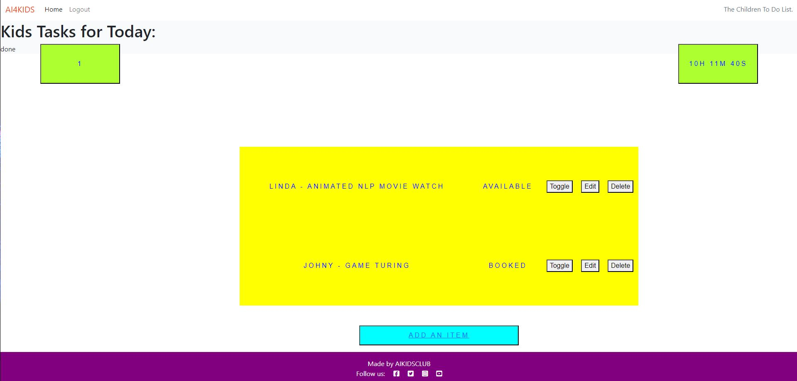

<h2>Features</h2>

**NAVIGATION BAR AND THE LOGO**

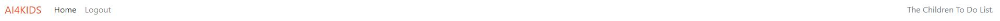

This feature a logo, The home, logout and a login link.  You can click on them to move to the log out page or log in if you would like to log in with your credentials. This Ends with Heading "Kids Taskds for Today" encouraging the user to look down for additional features.

**Counter of Done or Booked Items**

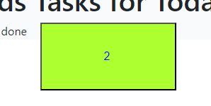

This feature is counts items that are confirmed or booked, this helps the teacher and the child to guage their workload and see if they are winning the day or not. 

**The Count Down!**

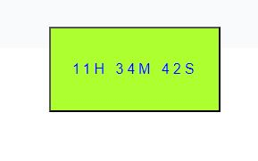

This feature is shows how many hours left untill the end of the day, this will help both the teacher and children tomanage their tasks better. 

**The logout link!**

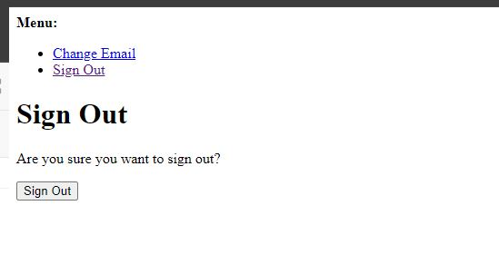

Clicking on logout will redirect you to a signout page as depicted ubove and if you do sign out then it is possible to sign in and log in it as see below. 

**CRUD FEATURES**

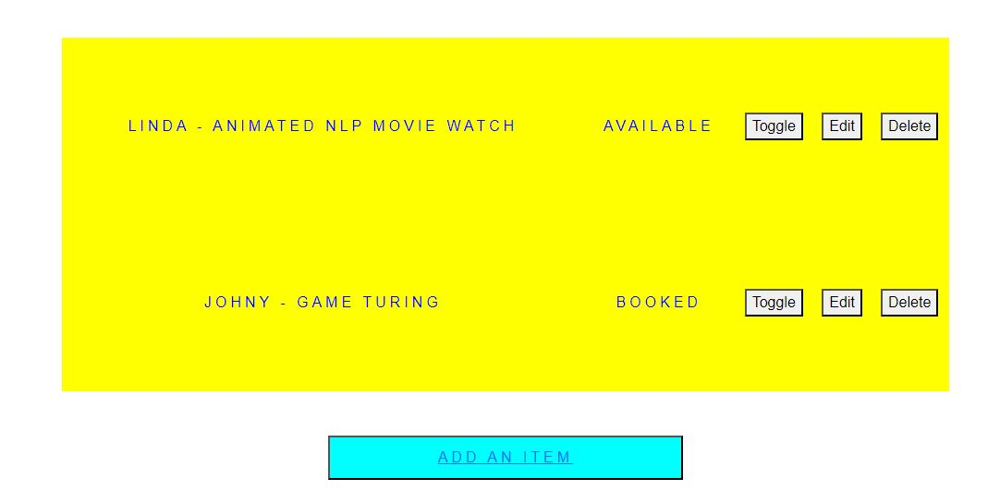

Delete button removes items from the list. If the list is ampty then you will see a message that says 'ADD A TASK...'

ADD AN ITEM button will direct you to a new page where you can type in the tittle of the new item and also confirm it by marking the check box called done as dipicted below"

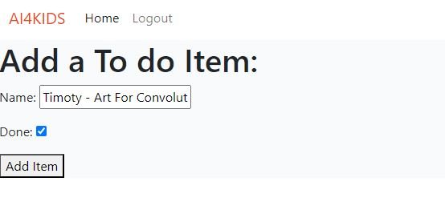

Clicking add item from this page will automatically redirect you back to home page. The Table on your home page will reflect the new item you just added as dipicted on the snip below:

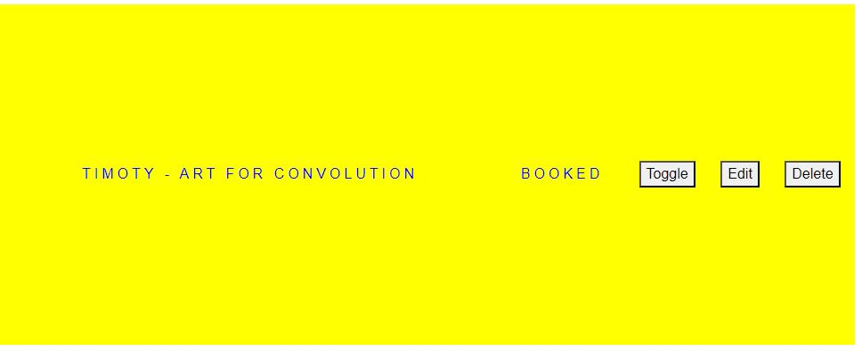

You can add as many items as you like as you can see from below snip the list will keep on increasing.  The Toggle button is used to switch from confirmed status to available status. Note that the number of confirmed or booked items corresponds with the counter on your top left-hand corner of your screen

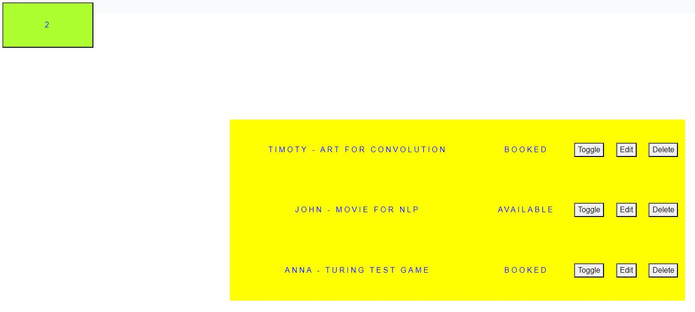

The Edit button will direct you to an Edit view where you can adjust an already existing item. Se we will change "Anna - Turing test Game" to Peter - Turing test Game

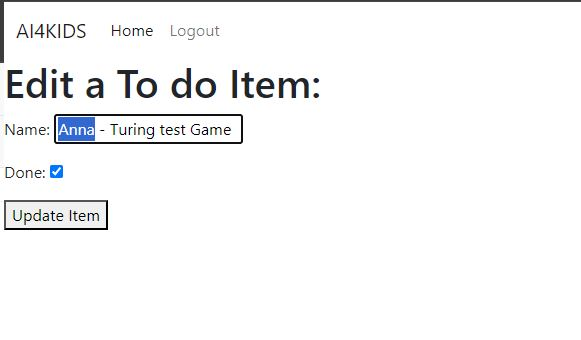

Clicking add item from this page will automatically redirect you back to home page. The Table on your home page will reflect the new item you just added as dipicted on the snip below:

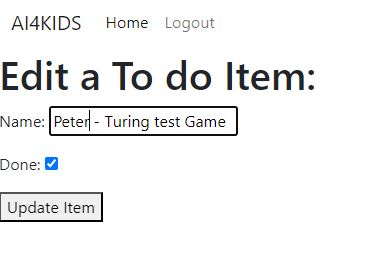

Clicking update item from this page will automatically redirect you back to home page. The Table on your home page will reflect the new edited item as dipicted on the snip below:

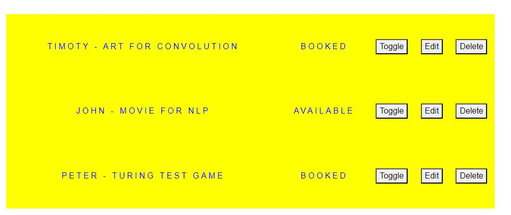

**CRUD ADMIN**

The administrator in this case a teacher is able to log in as a supper user and perform all the CRUD features above on behalf of any student if they call for these requests as dipicted on the below snip:

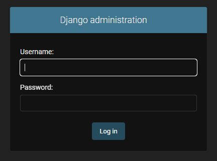
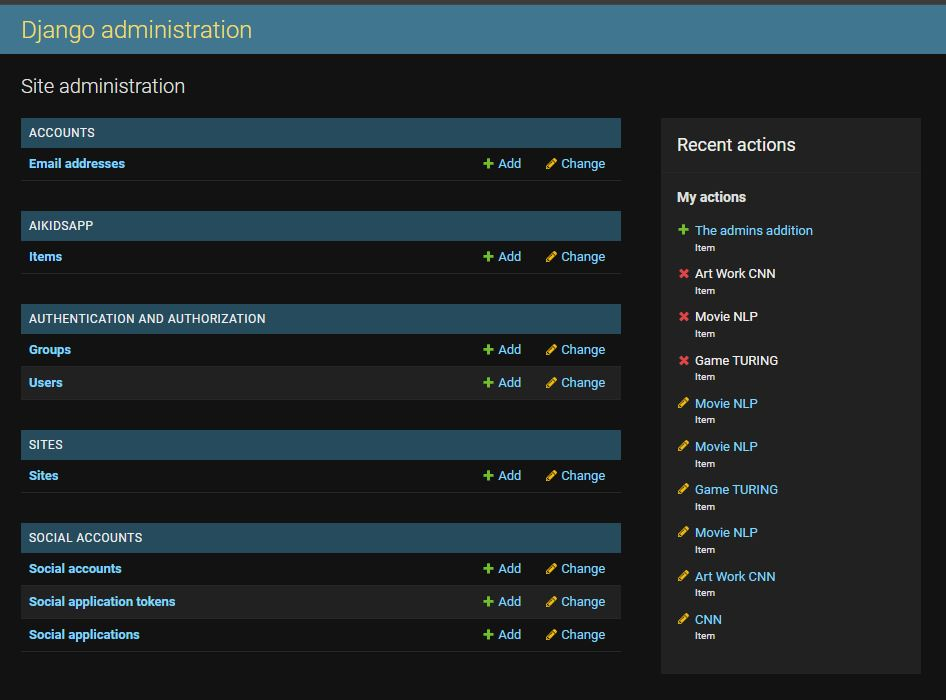
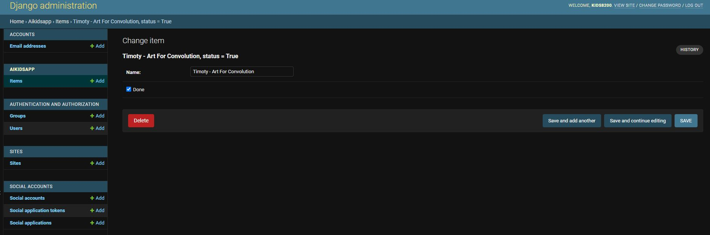

<h2>Agile Methodology</h2>

All the planning and implementation of all the above features preceeded by a planed user story which was moved in to progress status and when it was finished it was moved to the done columen as you can see from the snip below.  All but one task have been implemented.

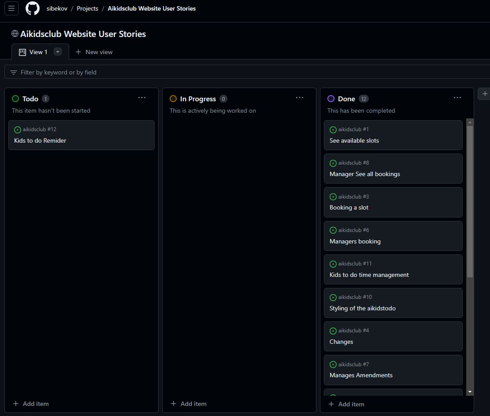