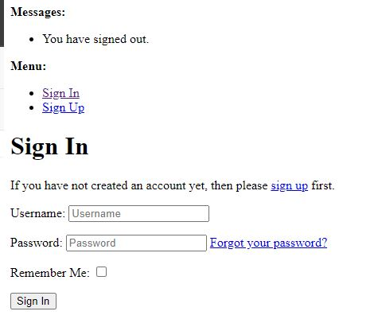

<h1>AI4KIDS CLUB TO DO LIST</h1>

AI4KIDS CLUB TO DO LIST is an app used to manage classes kids attend to learn Artificial Intelligence in a most natural way, Art,Movies and Games. All that kids need to do is to enter the class they wish to attend.  Once they are sure they will be coming to class then they can mark their booking as "Booked". If they are no longer interested then they can simply Toggle their class to "Available" for another kid to attend it or simply delete it from the list.

<h2>Features</h2>

**NAVIGATION BAR AND THE LOGO**

This feature a logo, The home, logout and a login link.  You can click on them to move to the log out page or log in if you would like to log in with your credentials. This Ends with Heading "Kids Taskds for Today" encouraging the user to look down for additional features.

**Counter of Done or Booked Items**

This feature is counts items that are confirmed or booked, this helps the teacher and the child to guage their workload and see if they are winning the day or not. 

**The Count Down!**

This feature is shows how many hours left untill the end of the day, this will help both the teacher and children tomanage their tasks better. 

**The logout link!**

Clicking on logout will redirect you to a signout page as depicted ubove and if you do sign out then it is possible to sign in and log in it as see below. 

**CRUD FEATURES**

Delete button removes items from the list. If the list is ampty then you will see a message that says 'ADD A TASK...'

ADD AN ITEM button will direct you to a new page where you can type in the tittle of the new item and also confirm it by marking the check box called done as dipicted below"

Clicking add item from this page will automatically redirect you back to home page. The Table on your home page will reflect the new item you just added as dipicted on the snip below:

You can add as many items as you like as you can see from below snip the list will keep on increasing.  The Toggle button is used to switch from confirmed status to available status. Note that the number of confirmed or booked items corresponds with the counter on your top left-hand corner of your screen

The Edit button will direct you to an Edit view where you can adjust an already existing item. Se we will change "Anna - Turing test Game" to Peter - Turing test Game

Clicking add item from this page will automatically redirect you back to home page. The Table on your home page will reflect the new item you just added as dipicted on the snip below:

Clicking update item from this page will automatically redirect you back to home page. The Table on your home page will reflect the new edited item as dipicted on the snip below:

**CRUD ADMIN**

The administrator in this case a teacher is able to log in as a supper user and perform all the CRUD features above on behalf of any student if they call for these requests as dipicted on the below snip:

<h2>Agile Methodology</h2>

**USER STORIES MANAGEMENT**

All the planning and implementation of all the above features preceeded by a planed user story which was moved in to progress status and when it was finished it was moved to the done columen as you can see from the snip below.  All but one task have been implemented.

<h2>Testing</h2>

**MODEL TEST**

Testing Models has not errors. Error would show an E instead of the dot. Running a test on models give a dot which is a pass status as dipicted on the snip below:

**VIEW TEST**

Testing Views is the same, there are no Es for errors. Running the test on views lead to only dots meaing all the function for view run with no problems. Below snip:

**FORM TEST**

Testing Forms requirements of not leaving empty fealds and making them required have been coded correctly, this is shown by no E for errors on the results but only dots. see snip below:

**COVERAGE TEST**

Initial Coverage show that there important tests that we did not cover. In this case Models is missing 17% percent of important tests.

Investigating this further shows that I did not cover the string method.
 

Adjusting this lead to an improved resulst as seen from the snip below. The models status is at 100% as opposed to the initial 83%

The Second missing coverage relates to views, specifically the post method on forms.

Adjusting this lead to an improved resulst as seen from the snip below. The views status is at 100% as opposed to the initial 89%

**UPDATED COVERAGE TEST**

Final Coverage is at 100% meaning all important tests have been covered. The logic is up to the coder. see below snip depicting all coverage improved to 100%

<h2>CREDITS</h2>

**CODE INSTITUTE WALK THROUGH PROJECTS**

* Hello Django help me a lot with the understanding of CRUD
* I Think therefore I blog help me with the understanding of class based views.

**CODE INSTITUTE TUTORS**

* Rebecca helped me with the understanding of the proc file and setting up the gunicorn server for successfull first deployment of an empty project.

* John Cork help me with the understanding of context which enabled me to complete my counter feature.

**UNSPLASH.COM**
Supplied a free picture of a child girl playing with toy truck which I will use in the future for background
https://unsplash.com/photos/boy-lying-on-bed-playing-with-red-and-blue-toy-truck-oUgZVBaGcEQ

**STACKOVERFLOW.COM**

Give me more understanding for countdowns.
https://stackoverflow.com/questions/3620943/measuring-elapsed-time-with-the-time-module

**w3schools**
help me refresh my memory on strings length method.
https://www.w3schools.com/python/gloss_python_string_length.asp

**w3schools**
This helped me with the understanding of how to code to count down the number of hours left.
https://www.w3schools.com/howto/howto_js_countdown.asp

**fontawesome**
Helpme with the implementation of my footer.
"https://kit.fontawesome.com/ca1eefdd78.js"

**fonts.gstatic**
"https://fonts.gstatic.com">

**fonts.googleapis**
https://fonts.googleapis.com/css2?family=Lato:wght@300;700&display=swap

**cloudflare**
"https://cdnjs.cloudflare.com/ajax/libs/font-awesome/5.15.3/css/all.min.css"

**bootstrap**
"https://cdn.jsdelivr.net/npm/bootstrap@5.0.1/dist/css/bootstrap.min.css"